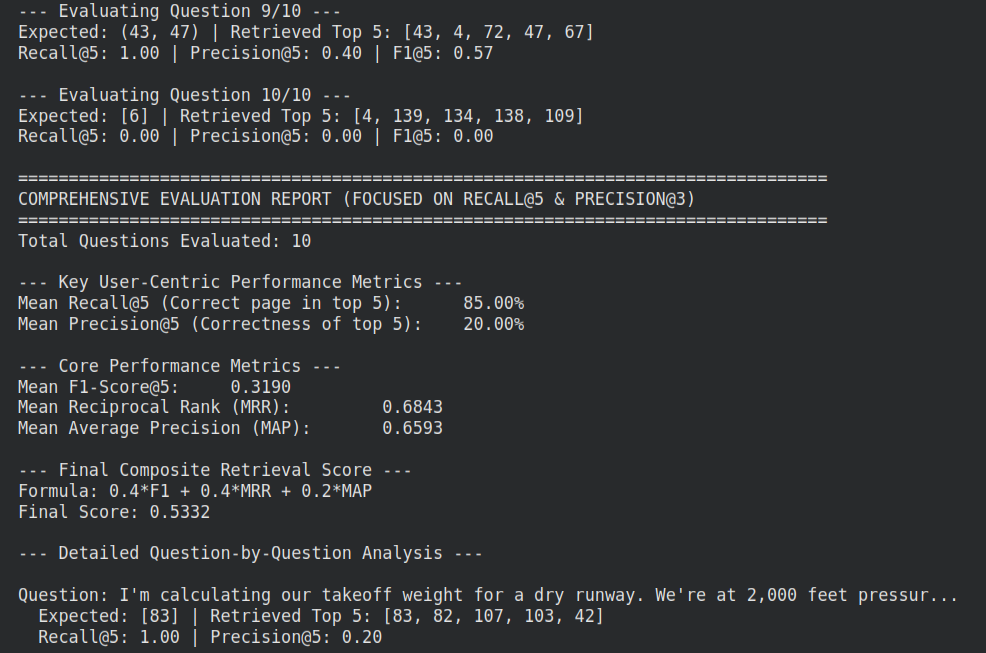
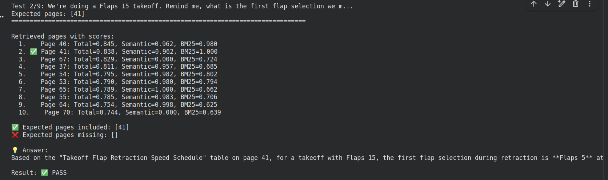

# Boeing 737 Manual RAG API

This project provides a REST API to ask questions about the Boeing 737 Operations Manual. It uses a Retrieval-Augmented Generation (RAG) architecture to find relevant information from the manual and generate accurate answers using Google's Gemini model.


To effectively handle the diverse content in the Boeing manual, a sophisticated chunking strategy was employed: 

**Page Classification**: Each page is analyzed and classified as text, visual (diagrams, images), or performance_table based on text length, ink density, and the presence of images. 
**Content-Specific Chunking:**
- Performance Tables: These are critical for operational queries. We identified them using keywords and then enhanced their text content by prepending structured metadata (e.g., "PERFORMANCE TABLE: FIELD AND CLIMB LIMIT WEIGHTS, Altitude: 2000 FT, Runway: DRY"). This makes them highly discoverable during retrieval.
- Visual Pages: Pages identified as diagrams or images are kept as a single, whole chunk to preserve their context.
- Standard Text Pages: These are split into smaller, overlapping chunks using a RecursiveCharacterTextSplitter to ensure that no relevant information is lost at a chunk boundary.
          
**Indexing for Hybrid Search Indexing for Hybrid Search**

To enable fast and accurate retrieval, we use a hybrid search approach that combines the strengths of two different methods: 

- Semantic Search (FAISS): We use the all-MiniLM-L6-v2 model from sentence-transformers to convert text chunks into vector embeddings. These embeddings are stored in a faiss-cpu index. This allows the system to find content that is semantically similar to the user's question, even if they don't use the exact same keywords.
- Keyword Search (BM25): We use the rank-bm25 algorithm to create a classic keyword search index. This is highly effective for finding exact matches on specific terms, such as part numbers, acronyms, or technical phrases.
     

To enable fast and accurate retrieval, we use a hybrid search approach that combines the strengths of two different methods: 

- Semantic Search (FAISS): We use the all-MiniLM-L6-v2 model from sentence-transformers to convert text chunks into vector embeddings. These embeddings are stored in a faiss-cpu index. This allows the system to find content that is semantically similar to the user's question, even if they don't use the exact same keywords.
- Keyword Search (BM25): We use the rank-bm25 algorithm to create a classic keyword search index. This is highly effective for finding exact matches on specific terms, such as part numbers, acronyms, or technical phrases.
     
Retrieval and Reranking 
Current Method: Heuristic Reranking 

After the initial hybrid search, the results are passed through a simple reranking step. This method uses heuristics to boost the scores of certain chunks based on the type of query

While this method is fast and provides a noticeable improvement over raw hybrid search scores, it is limited by its reliance on manually defined rules. 
Future Improvements: Cross-Encoder Reranking 

## Evaluation

We used a combination of standard information retrieval metrics to get a comprehensive view of the system's performance: 

- Recall@5: Measures if at least one correct page was found within the top 5 results. It answers: "Did we find what we were looking for?"
- Precision@5: Measures the proportion of the top 5 results that were correct. It answers: "Of the results we showed, how many were relevant?"
- F1-Score@5: The harmonic mean of Precision@5 and Recall@5, providing a single score that balances both.
- Mean Reciprocal Rank (MRR): The average of the reciprocal ranks of the first correct answer. It rewards systems that place the correct answer higher up in the results list.
- Mean Average Precision (MAP): Calculates the precision for each correct answer in the ranked list and averages them. It rewards systems that retrieve all correct items and do so early on.
     
- retrieval_score = (0.4 * F1) + (0.4 * MRR) + (0.2 * MAP)




The precision is low because out of the 5 pages the system shows you, only about 1.1 pages are actually correct on average which is normal.

## Setup and Installation

### Prerequisites

-   Python 3.8+
-   **Pre-generated index files**: `boeing_manual_faiss.index`, `boeing_manual_bm25.pkl`, `boeing_manual_chunks.pkl`.
-   A Google Gemini API key.

### Steps

1.  **Clone the Repository**
    ```bash
    git clone 
    cd boeing-rag-api
    ```

2.  **Create a Virtual Environment**
    ```bash
    python -m venv venv
    # On Windows
    # venv\Scripts\activate
    # On macOS/Linux
    source venv/bin/activate
    ```

3.  **Install Dependencies**
    ```bash
    pip install -r requirements.txt
    ```

4.  **Provide Pre-generated Indexes**
    -   Create a `data/` directory in the project root: `mkdir data`
    -   Place your pre-generated index files (`boeing_manual_faiss.index`, `boeing_manual_bm25.pkl`, `boeing_manual_chunks.pkl`) inside the `data/` directory.

5.  **Configure Environment Variables**
    -   Copy the `.env.example` file to `.env`:
        ```bash
        cp .env.example .env
        ```
    -   Open the `.env` file and fill in your `GEMINI_API_KEY`. The file paths should already be correct if you followed step 4.

## Running the Application

Execute the following command from the root directory:

```bash
python main.py
```

API Usage 

Access the interactive documentation at http://localhost:8000/docs  to test the /ask endpoint. 